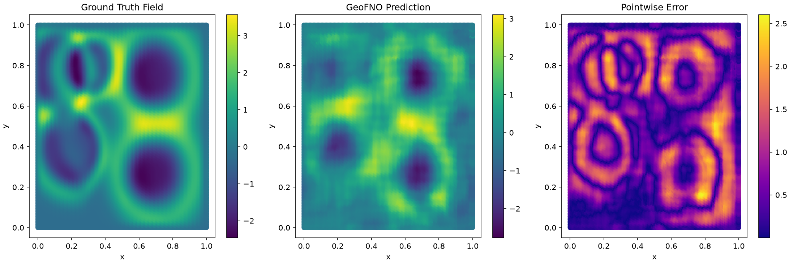
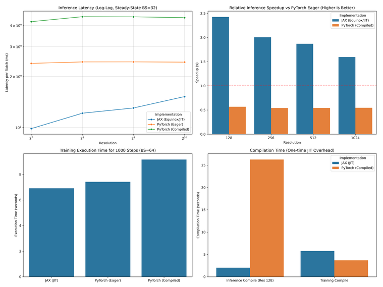

# Neojax

[](https://pypi.org/project/neojax-operators/)
[](https://github.com/paulgekeler/neojax/actions)
[](https://paulgekeler.github.io/neojax/)
[](https://github.com/paulgekeler/neojax/blob/main/LICENSE)
[](https://pypi.org/project/neojax-operators/)

**neojax** (**Ne**ural **O**perators in **JAX**) is an implementation of Neural Operators built on top of [JAX](https://github.com/jax-ml/jax) and [Equinox](https://github.com/patrick-kidger/equinox). It provides a clean, modular API inspired by the original [neuraloperator](https://github.com/neuraloperator/neuraloperator) library.

It is designed to be fully compatible with all JAX features such as `vmap`, `jit`, and `grad`.

One of several model architecture **neojax** implements is...

### Example: 2D wave propagation with spatially varying speed (GeoFNO)



Trained in [`docs/examples/05_advanced_training.ipynb`](docs/examples/05_advanced_training.ipynb) — 
predicts wave fields over heterogeneous media with a single forward pass.

### Available Features

Currently, **neojax** is in its early stages. Expect possible breaking changes.

Only the following models and features are available:
<details>
<summary>Full feature list</summary>

- **Fourier Neural Operator (FNO)**.
  - Symmetrical domain padding (`DomainPadding`).
  - Pointwise MLP (Channel-MLP) expansions for improved expressivity.
  - Various skip connections (Linear, Soft-Gating, Identity).
  - Normalization in FNO blocks.
- **U-Net Fourier Neural Operator (UNO)**.
- **Geometry-aware Fourier Neural Operator (GeoFNO)** for irregular geometries and mesh domains.
- **Tucker-factorized FNO**.
- **Deep Operator Network (DeepONet)**.
- **Training Orchestration Utilities** (`Trainer` and `TrainState`).
- Grid-based positional embeddings (`GridEmbeddingNd`).
- (Relative) $L^{p}$-loss.
- General $W^{k,p}$ Sobolev loss.
- Loss Compositions.
- Data Normalization and Scaling.
  - Various Normalizer classes.
  - Physical scales to non-dimensionalize inputs.
- **Dataset utilities (Data-agnostic, downloading utilities, etc.)**
- **Data Pipelines (Schemas, Processors, DataBundle)**
- **Benchmark Module (Model-/Data-agnostic even for non-neojax models)**

</details>

### Installation

Install the python package via pypi
```bash
pip3 install neojax-operators
```

The core library is designed to have as few dependencies as possible. Some submodules therefore rely on additional dependencies. Install them as needed:

- Running the examples: `neojax-operators[ex]`
- Using the PDE data generation: `neojax-operators[gen]`
- Using data downloading and some other data features: `neojax-operators[data]`
- Using the benchmark module: `neojax-operators[benchmark]`

### Quickstart
**neojax** exposes a similar API to neuraloperators and equinox and should therefore be familiar to use:
```python
import jax.numpy as jnp
import jax.random as jr
from neojax.models import FNO

key = jr.key(0)

fno = FNO(
      key=key,
      modes=(12, 12),
      hidden_channels=64,
      in_channels=2,
      out_channels=1,
      n_layers=2
)

x = jnp.ones((2, 64, 64))

pred = fno(x)
```

For a more detailed introduction refer to the examples in the documentation.

### Performance
**neojax** leverages JAX's static compilation to outperform PyTorch, especially for spectral operators like FNO.

| | Inference speedup vs PyTorch (eager / compiled) |
|---|---|
| 1D Burgers (res 128) | **2.4x / 4.3x** |
| 2D Navier-Stokes (128×128) | 1.2x / 1.1x |

<details>
<summary>Benchmark plot (1D Burgers, A100)</summary>



</details>

Full methodology, more PDEs, and reproduction scripts → [`benchmarks/`](benchmarks/)

### Motivation
JAX is widely used in Scientific Machine Learning (SciML) for its functional transformations (`jit`, `vmap`, `grad`) and NumPy-like API. Neural Operators are a common approach for solving PDEs in this space, but a native JAX implementation was missing. **neojax** fills that gap.

### Design Choices
**neojax** started as a port of the PyTorch `neuraloperator` library, but was rewritten from the ground up as a JAX-native implementation instead. Porting PyTorch idioms directly into a functional framework added unnecessary complexity; building on Equinox gives **neojax** a class-based API while staying consistent with JAX's pure-functional design.


### Roadplan
In upcoming releases more models and components will be added in roughly the following order:

1. LocalNO, SFNO, RNO, and others
2. Graph Neural Operators
3. Debugging utilities

And much more to come!

### Contributions
If you'd like to contribute any features, models, or fix implementation errors, please do so. Any contributions are appreciated. Have a look at the `CONTRIBUTING.md` guide for details on how to do so. I am also open to advice on restructuring and any other design choices that could be improved.

### Citation
If you use **neojax** in your research, please cite it using the following BibTeX entry:

```bibtex
@software{neojax,
  author = {Paul Gekeler},
  title = {neojax: Neural Operators in Jax},
  year = {2026},
  url = {https://github.com/paulgekeler/neojax}
}
```
