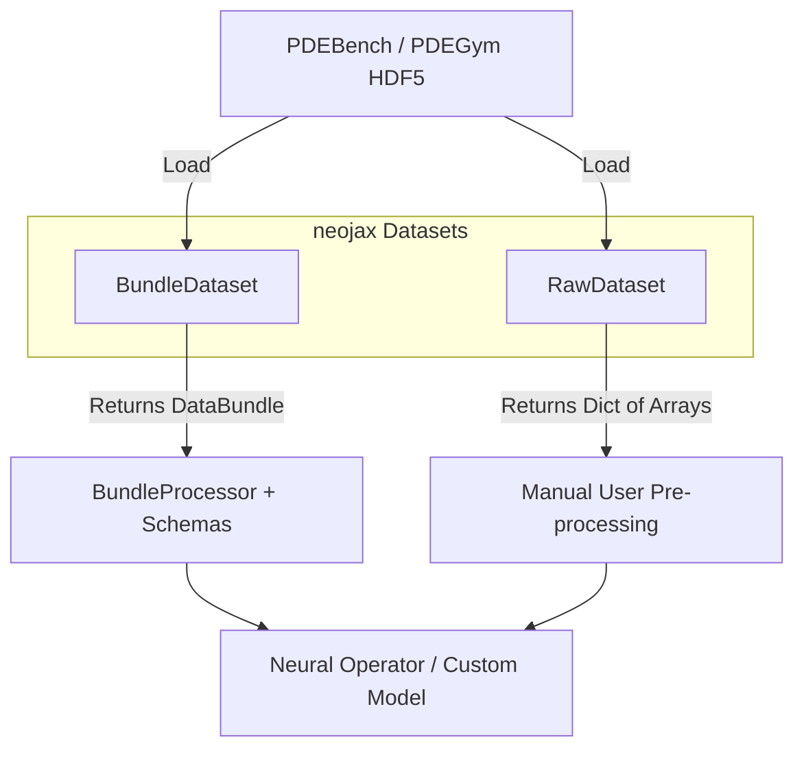

# Datasets API

`neojax` provides dataset classes for loading physical simulation and PDE data, in two formats:

1. **`BundleDataset`**: Returns typed `DataBundle` objects, packaging fields, coordinates, boundary conditions, and parameters into a single structured PyTree. Use this to work with `Schemas` and `BundleProcessor` for normalization and reshaping.
2. **`RawDataset`**: Returns plain Python dictionaries of raw JAX arrays (e.g. `{"fields": ..., "coords": ...}`). Use this to write your own pre-processing logic instead of going through `DataBundle` and `Schemas`.

### Diagram: Dataset Workflows

---

::: neojax.data.datasets.base_dataset.BaseDataset

::: neojax.data.datasets.bundle_dataset.BundleDataset

::: neojax.data.datasets.raw_dataset.RawDataset
