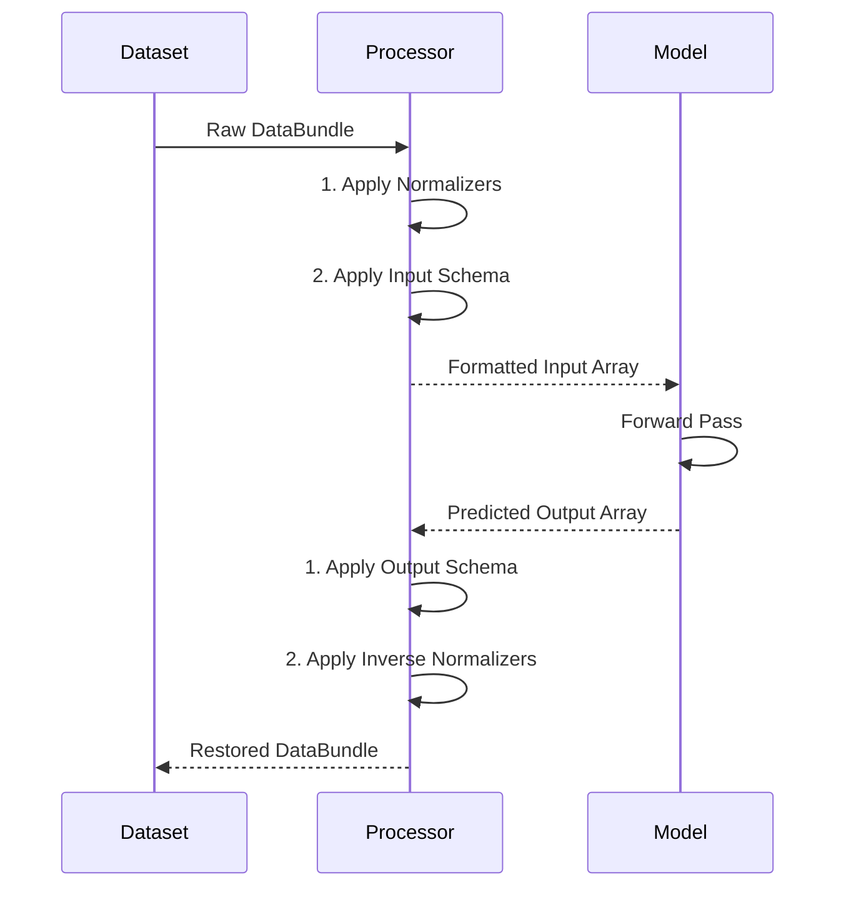

# Bundle Processor API

`BundleProcessor` sits between a dataset and a model. It combines `BaseNormalizer` instances with a `BaseSchema`, so that the glue code between a dataset and a model does not have to change when either one is swapped out. A `BundleProcessor` bundles two operations:

1. **`transform`**: Normalizes a `DataBundle`'s fields, then applies a schema to produce the array (or PyTree) format the model expects.
2. **`inverse_transform`**: Applies a schema to map model outputs back into a `DataBundle`, then reverses the normalization to restore the original physical scale.

### Diagram: End-to-End Execution

---

::: neojax.data.BundleProcessor
