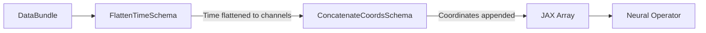

# Schemas API

Schemas define deterministic structural transformations for physical data. Neural operators expect data in specific shapes (e.g. spatial coordinates appended to the channel dimension, time flattened into channels), and schemas are the adapters between a dataset's `DataBundle` format and whatever shape a given model architecture expects. `ComposedSchema` chains several schemas together into a single transformation.

### Diagram: Schema Pipeline

Here is an example pipeline:

Typically, if you'd like to combine two or more schemas, it makes sense to wrap them in a `ComposedSchema`.

!!! info
    All schemas accept both `DataBundle` objects and raw JAX arrays, so they can also be used to manipulate raw arrays from `RawDataset` without going through `DataBundle`.

!!! warning "Schema order in ComposedSchema"
    Not all schemas may be used at arbitrary positions inside a `ComposedSchema`. This is a known limitation with no good fix as of right now.
    Have a look at the `ComposedSchema` documentation for details.

---

::: neojax.data.schemas.IdentitySchema

---

::: neojax.data.schemas.FlattenTimeSchema

---

::: neojax.data.schemas.ConcatenateCoordsSchema
    options:
        members:
            - transform

---

::: neojax.data.schemas.BundleReconstructSchema
    options:
        members:
            - transform

---

::: neojax.data.schemas.TimeToStationarySchema
    options:
        members:
            - transform

---

::: neojax.data.schemas.ConcatenateParamsSchema
    options:
        members:
            - transform

---

::: neojax.data.schemas.ComposedSchema

---

::: neojax.data.schemas.BaseSchema