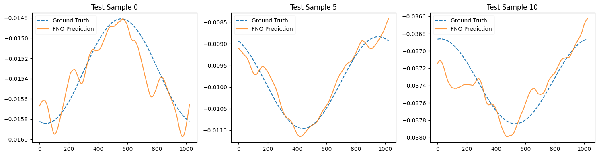

### Example 2: Training a FNO on Burgers Equation with **neojax**

[:material-download: Download Notebook](02_fno_burgers.ipynb){ .md-button }

In this second example, we showcase how to train a Fourier Neural Operator on Burgers equation.

To run this example, we first install and import the necessary python dependencies:

```bash
pip3 install "neojax-operators[ex]"
```

```python
import equinox as eqx
import jax
import jax.numpy as jnp
import jax.random as jr

# we use optax for gradient optimizers
import optax

from neojax.models import FNO
from neojax.nn import GridEmbeddingNd
```

#### Burgers Equation
Burgers equation is a classical example of a 1d non-linear PDE used in Neural Operator publications:

$$
\begin{aligned}
\frac{\partial}{\partial t}u(x, t) + \frac{1}{2}\frac{\partial}{\partial x}(u(x,t))^2 &= \nu \frac{\partial^2}{\partial x^2}u(x,t), \; \quad x \in (0,2\pi), t \in (0, \infty) \\
u(x, 0) &= u_0(x), \quad \quad \quad \quad x \in (0, 2\pi)
\end{aligned}
$$

with a fixed viscosity $\nu = 10^{-1}$. The initial condition is drawn from $\mu = \mathcal{N}(0, C)$, i.e., $u_0 \sim \mu$, where

$$
C = 625(-\frac{d^2}{dx^2} + 25I)^{-2}.
$$

#### Generating data
We import the `generate_burgers_1d` function from **neojax** data generation module which solves the 1D Burgers equation using a pseudo-spectral split step method (see [^1]).

We generate a total of 1000 training and 200 test samples. Generation takes around 6 minutes on a CPU but is considerably faster on a GPU.

[^1]: Kovachki, N. et al. "Neural Operator: Learning Maps Between Function Spaces With Applications to PDEs". JMLR 2023, https://www.jmlr.org/papers/volume24/21-1524/21-1524.pdf.

```python
from neojax.data.generation import generate_burgers_1d

# generate 1000 training pairs and 200 testing pairs
# returns dataset containing dict(inputs=Array, labels=Array)
dataset = generate_burgers_1d(n_samples=1200, n_grid_points=1024, nu=0.1, t1=1.0, batch_size=100, use_bundle=False)
```

**Output:**
```bash
Generating 1200 initial conditions from GRF...
Compiling and solving physics trajectories via Diffrax at 1024 resolution...
Solving batch 1/12...
Solving batch 2/12...
Solving batch 3/12...
Solving batch 4/12...
Solving batch 5/12...
Solving batch 6/12...
Solving batch 7/12...
Solving batch 8/12...
Solving batch 9/12...
Solving batch 10/12...
Solving batch 11/12...
Solving batch 12/12...
Converting data back to spatial domain...
```

!!! info
    Complex support is still a work in progress in **Diffrax**, so some warnings may appear.


Now we use **neojax** built-in normalization pipelines to normalize the inputs. The `dataset` is just a PyTree we can handle easily.
We concatenate `input` and `label` arrays and compute the normalization mean and std over them.

```python
import jax.tree_util as jtu

from neojax.data.normalizers import UnitGaussianNormalizer

# fit normalizer to dataset
normalizer = UnitGaussianNormalizer()
normalizer = normalizer.compute_stats(jnp.concat(jtu.tree_leaves(dataset), axis=0), axis=None)
```

#### Loss Function
We also use the standard relative $L^2$ error

$$
\text{Relative } L^2 \text{ Error} = \frac{\Vert \hat{y} - y\Vert_{L^2}}{\Vert y \Vert_{L^2}}
$$

were $\hat{y}$ is the network prediction and $y$ the ground truth.

We import the respective loss from **neojax**.

```python
from neojax.metrics import RelativeLpMetric

rel_l2_error = RelativeLpMetric(p=2)
```

#### Training
We use common training settings:

- Adam optimizer
- Cosine decay scheduler
- Train for 800 epochs
- Initial learning rate of 1e-3
- The hidden channel dimensions $d_{v_i}$ = 64
- The number of Fourier modes is set to 8

We use **Optax** for the gradient optimizer and **Equinox** for the weight updates.

We first initialize the model, the optimizer, the training parameters and split the dataset into training and test sets.

```python
# Initialize the model
fno_key = jr.key(seed=1)
grid_embedding = GridEmbeddingNd(in_channels=1, ndim=1)
fno = FNO(
    key=fno_key,
    in_channels=1,
    out_channels=1,
    hidden_channels=64,
    n_layers=4,
    modes=(8,),
    positional_embedding=grid_embedding,
    domain_padding=0.1,
)

n_train_samples = 1000
# Split dataset into train and test
train_dset = dataset[:n_train_samples]
test_dset = dataset[n_train_samples:]

# Create batch sizes and number of epochs
batch_size = 32
num_epochs = 800
key = jr.key(0)

# Compute number of total steps
total_steps = num_epochs * (n_train_samples // batch_size)

# Create a Cosine Decay Schedule
cosine_schedule = optax.schedules.cosine_decay_schedule(1e-3, total_steps)
# Create Adam optimizer
optimizer = optax.adam(cosine_schedule)
# Initialize the optimizer state with the model parameters
# Here eqx.filter filters out all non-trainable parameters
opt_state = optimizer.init(eqx.filter(fno, eqx.is_array))
```

We then define the outer loss function, which includes vmapping the model over each batch
and computing the loss.

```python
# Create a loss function with our relative L2 error
def loss_fn(model, xb, y_true):
    # vmap model over batch
    y_pred = jax.vmap(model)(xb)
    return rel_l2_error(target=y_true, pred=y_pred)
```

Lastly, we define the jitted training step and the training loop. Here we use `equinox.filter_jit` and `equinox.filter_value_and_grad` instead of `equinox.{partition,combine}` to pass the model smoothly across `jit`/`grad` boundaries.


!!! info
    It is not advisable to `jit`-wrap the entire training routine. While it might provide some
    speedups, the resulting computational graph would be massive (the `for` loop is unrolled) which increases compilation time and we loose the ability to print intermediate losses and updates.
    Jitting only the training step is a good middle ground.

!!! info "Training Time"
    Training the model takes a few minutes. In Google Colab approximately 10 Minutes for 800 epochs on a Tesla T4 GPU.

```python
# Create a training step function that handles
# Computation of loss and gradients
# Optimizer updates
# -> We jit this block for jit-compilation
@eqx.filter_jit
def training_step(model, opt_state, xb, yb):
    loss, grads = eqx.filter_value_and_grad(loss_fn)(model, xb, yb)
    updates, opt_state = optimizer.update(grads, opt_state, eqx.filter(model, eqx.is_array))
    model = eqx.apply_updates(model, updates)
    return model, opt_state, loss

# Start the training loop
for epoch in range(num_epochs):
    key, perm_key = jr.split(key)
    perm = jr.permutation(perm_key, n_train_samples)

    for start in range(0, n_train_samples, batch_size):
        batch_idx = perm[start:start + batch_size]
        normed_ins = normalizer.transform(train_dset["inputs"][batch_idx])
        normed_gts = normalizer.transform(train_dset["labels"][batch_idx])
        fno, opt_state, train_loss = training_step(
            fno,
            opt_state,
            normed_ins,
            normed_gts,
        )

    # Make sure we compute validation loss on un-normalized predictions
    if (epoch + 1) % 10 == 0:
        normed_test_ins = normalizer.transform(test_dset["inputs"])
        test_preds = jax.vmap(fno)(normed_test_ins)
        test_preds = normalizer.inverse_transform(test_preds)
        test_rel_l2 = rel_l2_error(target=test_dset["labels"], pred=test_preds)
        print(
            f"Epoch {epoch + 1:03d} | loss={train_loss:.3e} "
            f"| test rel L2={test_rel_l2:.3e}"
        )
```

**Output:**
```bash
Epoch 010 | loss=1.128e-01 | test rel L2=2.856e-01
Epoch 020 | loss=3.150e-01 | test rel L2=4.586e-01
Epoch 030 | loss=2.793e-01 | test rel L2=2.048e-01
Epoch 040 | loss=3.851e-02 | test rel L2=1.060e-01
Epoch 050 | loss=1.579e-01 | test rel L2=2.221e-01
Epoch 060 | loss=1.277e-01 | test rel L2=1.172e-01
Epoch 070 | loss=1.162e-01 | test rel L2=8.537e-02
Epoch 080 | loss=7.651e-02 | test rel L2=1.291e-01
Epoch 090 | loss=6.666e-02 | test rel L2=1.626e-01
Epoch 100 | loss=1.888e-01 | test rel L2=9.952e-02
...
Epoch 710 | loss=1.385e-02 | test rel L2=2.693e-02
Epoch 720 | loss=1.055e-02 | test rel L2=2.645e-02
Epoch 730 | loss=1.144e-02 | test rel L2=2.663e-02
Epoch 740 | loss=1.453e-02 | test rel L2=2.636e-02
Epoch 750 | loss=1.130e-02 | test rel L2=2.634e-02
Epoch 760 | loss=1.232e-02 | test rel L2=2.632e-02
Epoch 770 | loss=1.546e-02 | test rel L2=2.630e-02
Epoch 780 | loss=4.107e-02 | test rel L2=2.630e-02
Epoch 790 | loss=1.325e-02 | test rel L2=2.630e-02
Epoch 800 | loss=9.695e-03 | test rel L2=2.630e-02
```

Although the final test loss is far off the SOTA on this problem, the model appears to have started to learn the underlying operator.

Lets visualize some predictions and see where we could still improve.

```python
import matplotlib.pyplot as plt
import jax.numpy as jnp

# Pick a few test samples
sample_indices = jnp.array([0, 5, 10])

# Transform inputs and get predictions
normed_test_ins = normalizer.transform(test_dset['inputs'][sample_indices])
preds = jax.vmap(fno)(normed_test_ins)
# Inverse transform back to physical space
preds_physical = normalizer.inverse_transform(preds)

fig, axes = plt.subplots(1, len(sample_indices), figsize=(15, 4))

for i, idx in enumerate(sample_indices.tolist()):
    axes[i].plot(test_dset['labels'][idx, 0], label='Ground Truth', linestyle='--')
    axes[i].plot(preds_physical[i, 0], label='FNO Prediction', alpha=0.8)
    axes[i].set_title(f"Test Sample {idx}")
    axes[i].legend()

plt.tight_layout()
plt.show()
```

**Output:**


For an introduction to **neojax** model-agnostic data pipelines, see this [example](03_data_pipeline.md).