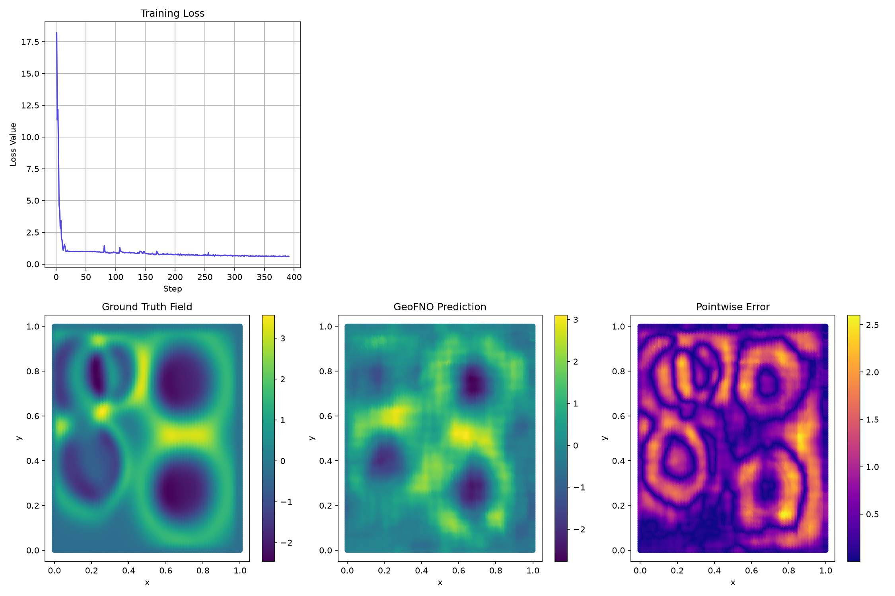

### Example 5: Advanced Training with Learnable Composed Loss Weights

[:material-download: Download Notebook](05_advanced_training.ipynb){ .md-button }

In this tutorial, we demonstrate how to set up an advanced training workflow in **neojax** using the built-in `Trainer` and `TrainState` orchestrators.

We will cover:

* Downloading the `wave_layer` dataset using the **neojax** downloader registry. Like other PDEGym datasets, it ships no explicit coordinate variable, so coordinates are generated automatically over the unit square.
* Implementing a physics-informed `PhysicsNormalizer` (non-dimensionalization via `CharacteristicLengthScale`) and `UnitGaussianNormalizer` directly on physical coordinates and field values.
* Formulating a composed loss function featuring learnable weights for relative $L^2$ error and Sobolev $H^1$ gradient penalty.
* Using the `is_learnable_metric_weight` utility function to define a `filter_spec` that optimizes the loss weights and model parameters simultaneously.
* Executing a multi-epoch training loop, saving and reloading checkpoints, and plotting training statistics and predictions using `matplotlib`.

To run this example, we first install and import the necessary python dependencies:

```bash
pip3 install "neojax-operators[ex,data]"
```

```python
import os
import tempfile
from pathlib import Path

import jax
import jax.numpy as jnp
import jax.random as jr
import optax
import equinox as eqx
import numpy as np
import netCDF4 as nc
import matplotlib.pyplot as plt

from neojax.data.download import download_dataset
from neojax.data.datasets import BundleDataset
from neojax.data.normalizers import UnitGaussianNormalizer, PhysicsNormalizer
from neojax.data.scales import CharacteristicLengthScale
from neojax.models import GeoFNO
from neojax.metrics import ComposedMetric, RelativeLpMetric, SobolevMetric
from neojax.metrics.utils import is_learnable_metric_weight
from neojax.training import Trainer, TrainState
```

#### Mock NetCDF Fallback Generator
To ensure this tutorial notebook can execute in offline or sandboxed testing environments without making network queries, we provide a mock generator that mimics the PDEgym `Wave-Layer` dataset schema if the download fails.

Like other PDEGym datasets, `wave_layer` ships no explicit coordinate variable and no explicit channel axis (the field has a single physical channel). The `solution` variable's dimensions are `(sample, time, x, y)`.

```python
def generate_mock_wave_layer_nc(file_path: Path) -> None:
    """Generates a mock NetCDF dataset mirroring PDEgym's Wave-Layer schema."""
    with nc.Dataset(file_path, "w") as f:
        f.createDimension("sample", 16)
        f.createDimension("time", 1)
        f.createDimension("x", 16)
        f.createDimension("y", 16)

        # Trajectories solution (sample=16, time=1, x=16, y=16); no explicit
        # channel or coordinate variable, matching the real Wave-Layer files.
        solution = np.random.randn(16, 1, 16, 16).astype(np.float32)
        s_var = f.createVariable("solution", "f4", ("sample", "time", "x", "y"))
        s_var[:] = solution
```

#### Download and Load wave_layer Dataset
We query the registry to locate `wave_layer` and download it directly to a local scratch directory, falling back to mock data if offline.

(To avoid high RAM usage, we remove two thirds of the dataset before loading it. Remove this if you have the RAM. This is a dodgy solution and `download_dataset` will expose an option to control dataset sizes in future versions.)

For any dataset that doesn't explicitly provide coordinates, as is the case for the Wave-Layer dataset, even spacing over the domain is assumed and the coordinates are created as such.

Creating `DataBundle` datasets requires passing a mapping from dataset variable names to the class fields of `DataBundle`. This mapping may specify concatenations of variables by passing a one-to-many mapping and the respective `concat_axes`. See the documentation for details.

*WARNING: Loading the BundleDataset loads one third of the dataset into RAM (~5.5GB).*

```python
tmpdir = tempfile.TemporaryDirectory()
data_dir = Path(tmpdir.name)

try:
    print("Attempting to download wave_layer dataset from Hugging Face registry...")
    downloaded_files = download_dataset("wave_layer", target_dir=data_dir)
    print(f"Successfully downloaded wave_layer dataset to: {data_dir}")
    for f in data_dir.iterdir():
        if f.is_file() and f.name in (f"solution_{i}.nc" for i in range(1, 3)):
            f.unlink()
    data_path = data_dir
except Exception as e:
    print(f"Could not download dataset ({e}). Creating mock wave_layer NetCDF instead.")
    data_path = data_dir / "wave_layer_solution.nc"
    generate_mock_wave_layer_nc(data_path)

# Load NetCDF file into a DataBundle dataset.
# We map the propagation speed c to the "parameters" field and the solution to the "fields".
# Because "coords" is not provided, an evenly spaced grid over the unit square is generated
# automatically, and a singleton channel axis is inserted since 'solution' has none of its own.
dataset = BundleDataset.from_pdegym(
    data_path, field_mapping={"fields": "solution", "parameters": "c"}
)

print(
    f"Loaded dataset. Coords shape: {dataset.coords.shape}, Fields shape: {dataset.fields.shape}"
)
```

**Output:**
```bash
Attempting to download wave_layer dataset from Hugging Face registry...
c_0.nc: 100%|██████████| 690M/690M [00:09<00:00, 69.5MB/s]
solution_0.nc: 100%|██████████| 4.83G/4.83G [00:48<00:00, 98.7MB/s]
solution_1.nc: 100%|██████████| 4.83G/4.83G [00:47<00:00, 103MB/s]
solution_2.nc: 100%|██████████| 4.83G/4.83G [00:59<00:00, 81.7MB/s]
Successfully downloaded wave_layer dataset to: /tmp/tmposqbdhlv
/tmp/ipykernel_7261/4278115138.py:21: UserWarning: No 'coords' entry in field_mapping; generating default coordinates as an evenly spaced grid over the unit hypercube [0, 1]^2 with spatial shape (128, 128). Pass an explicit 'coords' mapping to use the dataset's own physical domain.
  dataset = BundleDataset.from_pdegym(
Loaded dataset. Coords shape: (2, 128, 128), Fields shape: (3504, 21, 1, 128, 128)
```

#### Configure Normalizers and Process Datasets
We scale coordinate dimensions using a `PhysicsNormalizer` to enforce non-dimensional scaling, then pipe the fields through a standard `UnitGaussianNormalizer`.

```python
physics_norm = PhysicsNormalizer(CharacteristicLengthScale(L_ref=0.1))
unit_norm = UnitGaussianNormalizer()

coords_norm = physics_norm.compute_stats(dataset.coords)
fields_norm = unit_norm.compute_stats(dataset.fields)

# Split into train/validation trajectories using manual array slicing
train_dataset = BundleDataset(coords=dataset.coords, fields=dataset.fields[:12])
test_dataset = BundleDataset(coords=dataset.coords, fields=dataset.fields[12:])

# Apply normalizations
train_coords = coords_norm(train_dataset.coords)
train_fields = fields_norm(train_dataset.fields)

test_coords = coords_norm(test_dataset.coords)
test_fields = fields_norm(test_dataset.fields)

# Prepare inputs for GeoFNO's unstructured interface: squeeze the channel
# axis (size 1), then flatten the spatial grid into a list of points.
x_train = train_fields.squeeze(2)  # (12, 1, 16, 16)
y_train = train_fields.squeeze(2)  # (12, 1, 16, 16)

x_test = test_fields.squeeze(2)  # (4, 1, 16, 16)
y_test = test_fields.squeeze(2)  # (4, 1, 16, 16)

x_train = x_train.reshape(*x_train.shape[:2], -1)  # (12, 1, 256)
y_train = y_train.reshape(*y_train.shape[:2], -1)
x_test = x_test.reshape(*x_test.shape[:2], -1)
y_test = y_test.reshape(*y_test.shape[:2], -1)

# Flatten the coordinate grid into a list of points: (2, 16, 16) -> (256, 2)
coords_shared = train_coords.reshape(2, -1).T

print(f"Normalized data shapes:")
print(f"  Fields: {x_train.shape}")
print(f"  Shared coordinates: {coords_shared.shape}")
```

**Output:**
```bash
Normalized data shapes:
  Fields: (12, 21, 16384)
  Shared coordinates: (16384, 2)
```

#### Define the Combined Model and Loss Wrapper
To optimize both the network parameters and the loss weights in a single backward pass, we wrap the `GeoFNO` model and the learnable `ComposedMetric` in a single Equinox PyTree module.

```python
class ModelWithLoss(eqx.Module):
    model: GeoFNO
    loss_metric: ComposedMetric

    def __init__(self, model: GeoFNO, loss_metric: ComposedMetric):
        self.model = model
        self.loss_metric = loss_metric

    def __call__(self, x):
        return self.model(x)
```

#### Configure Learnable Loss Metrics
We create a composed loss combining relative $L^2$ error (with initial weight 0.9) and Sobolev $H^1$ penalty (with initial weight 0.1), marking their weights as learnable. We bind the shared mesh coordinates statically in our functional loss.

```python
rel_l2_metric = RelativeLpMetric(p=2.0, weight=0.9, learnable_weight=True)
sobolev_metric = SobolevMetric(p=2.0, k=1, weight=0.1, learnable_weight=True)

composed_loss_metric = ComposedMetric(rel_l2_metric, sobolev_metric, learnable_weight=True)

def loss_fn(model_with_loss: ModelWithLoss, batch):
    x, y = batch
    
    # Wrapper binding the flattened spatial grid coordinates statically
    model_fn = lambda u: model_with_loss.model(u, x_in=coords_shared)
    
    # Forward pass on all batch samples
    preds = jax.vmap(model_fn)(x)
    
    # Composed metric computes derivatives w.r.t input x
    return model_with_loss.loss_metric(model=model_fn, x=x, target=y, pred=preds)
```

#### Instantiate GeoFNO and Trainer
We instantiate the model, wrap it with the loss metric, build the custom `filter_spec`, and configure the `Trainer` orchestrator.

```python
key = jr.key(0)
model_key, train_key = jr.split(key)

model = GeoFNO(
    key=model_key,
    in_channels=1,
    out_channels=1,
    hidden_channels=16,
    n_layers=3,
    modes=(8, 8),
    grid_resolution=(16, 16),
)

model_with_loss = ModelWithLoss(model, composed_loss_metric)

# Combine FNO model parameters and learnable metric weights in a filter spec
filter_spec = ModelWithLoss(
    model=jax.tree_util.tree_map(eqx.is_inexact_array, model),
    loss_metric=is_learnable_metric_weight(composed_loss_metric)
)

optimizer = optax.adam(learning_rate=1e-3)
trainer = Trainer(optimizer=optimizer, loss_fn=loss_fn, filter_spec=filter_spec)
```

#### Execute Training Loop & Checkpoint State
We run the loop for 15 epochs, logging loss values and weight trajectories, then verify checkpointing.

```python
state = trainer.create_train_state(model_with_loss, metadata={"epoch": 0})

losses = []
l2_weights = []
h1_weights = []

print("Running training for 15 epochs...")
for epoch in range(15):
    state, loss_val = trainer.train_step(state, (x_train, y_train))
    l2_w = float(state.model.loss_metric.metrics[0].weight)
    h1_w = float(state.model.loss_metric.metrics[1].weight)
    
    losses.append(float(loss_val))
    l2_weights.append(l2_w)
    h1_weights.append(h1_w)
    print(f"Epoch {epoch+1:02d} | Loss: {loss_val:.4f} | L2 weight: {l2_w:.4f} | H1 weight: {h1_w:.4f}")
```

Output:
```
Running training for 15 epochs...
Epoch 01 | Loss: 1.0062 | L2 weight: 0.8990 | H1 weight: 0.0990
Epoch 02 | Loss: 1.0029 | L2 weight: 0.8980 | H1 weight: 0.0980
Epoch 03 | Loss: 0.9994 | L2 weight: 0.8970 | H1 weight: 0.0970
Epoch 04 | Loss: 0.9957 | L2 weight: 0.8960 | H1 weight: 0.0960
Epoch 05 | Loss: 0.9926 | L2 weight: 0.8950 | H1 weight: 0.0950
Epoch 06 | Loss: 0.9886 | L2 weight: 0.8940 | H1 weight: 0.0940
Epoch 07 | Loss: 0.9851 | L2 weight: 0.8930 | H1 weight: 0.0930
Epoch 08 | Loss: 0.9822 | L2 weight: 0.8920 | H1 weight: 0.0920
Epoch 09 | Loss: 0.9783 | L2 weight: 0.8910 | H1 weight: 0.0910
Epoch 10 | Loss: 0.9751 | L2 weight: 0.8900 | H1 weight: 0.0900
Epoch 11 | Loss: 0.9720 | L2 weight: 0.8890 | H1 weight: 0.0890
Epoch 12 | Loss: 0.9691 | L2 weight: 0.8880 | H1 weight: 0.0880
Epoch 13 | Loss: 0.9656 | L2 weight: 0.8870 | H1 weight: 0.0870
Epoch 14 | Loss: 0.9626 | L2 weight: 0.8860 | H1 weight: 0.0860
Epoch 15 | Loss: 0.9596 | L2 weight: 0.8850 | H1 weight: 0.0850
```

```python
# Checkpoint model state
checkpoint_file = data_dir / "train_state.bin"
model_hyperparams = {
    "in_channels": 1,
    "out_channels": 1,
    "hidden_channels": 16,
    "n_layers": 3,
    "modes": (8, 8),
    "grid_resolution": (16, 16),
}
state.save(checkpoint_file, model_hyperparams)
print("Saved checkpoint to disk.")
```

#### Plot Training Progress and Qualitative Predictions
We plot the training loss curve, loss weight progressions, and visualize model predictions on the (flattened) spatial grid.

```python
# Evaluate model on first test sample
model_fn = lambda u: state.model.model(u, x_in=coords_shared)
test_pred = model_fn(x_test[0])
test_target = y_test[0]
test_error = jnp.abs(test_target - test_pred)

# Set up matplotlib figure
fig, axes = plt.subplots(2, 3, figsize=(15, 10))

# Plot Training Loss
axes[0, 0].plot(range(1, 16), losses, marker="o", color="#4F46E5")
axes[0, 0].set_title("Training Loss")
axes[0, 0].set_xlabel("Epoch")
axes[0, 0].set_ylabel("Loss Value")
axes[0, 0].grid(True)

# Plot Learnable Loss Weights
axes[0, 1].plot(range(1, 16), l2_weights, label="Relative L2 Weight", marker="s", color="#10B981")
axes[0, 1].plot(range(1, 16), h1_weights, label="Sobolev H1 Weight", marker="^", color="#EF4444")
axes[0, 1].set_title("Learnable Loss Weights")
axes[0, 1].set_xlabel("Epoch")
axes[0, 1].set_ylabel("Weight Value")
axes[0, 1].legend()
axes[0, 1].grid(True)

axes[0, 2].axis("off")

# Scatter plot of the flattened spatial grid points, colored by field values
x_coords = coords_shared[:, 0]
y_coords = coords_shared[:, 1]

# Ground Truth
sc_gt = axes[1, 0].scatter(x_coords, y_coords, c=test_target[0], cmap="viridis", s=30)
axes[1, 0].set_title("Ground Truth Field")
axes[1, 0].set_xlabel("x")
axes[1, 0].set_ylabel("y")
fig.colorbar(sc_gt, ax=axes[1, 0])

# Prediction
sc_pred = axes[1, 1].scatter(x_coords, y_coords, c=test_pred[0], cmap="viridis", s=30)
axes[1, 1].set_title("GeoFNO Prediction")
axes[1, 1].set_xlabel("x")
axes[1, 1].set_ylabel("y")
fig.colorbar(sc_pred, ax=axes[1, 1])

# Absolute Error
sc_err = axes[1, 2].scatter(x_coords, y_coords, c=test_error[0], cmap="plasma", s=30)
axes[1, 2].set_title("Pointwise Error")
axes[1, 2].set_xlabel("x")
axes[1, 2].set_ylabel("y")
fig.colorbar(sc_err, ax=axes[1, 2])

plt.tight_layout()
plt.show()
```


